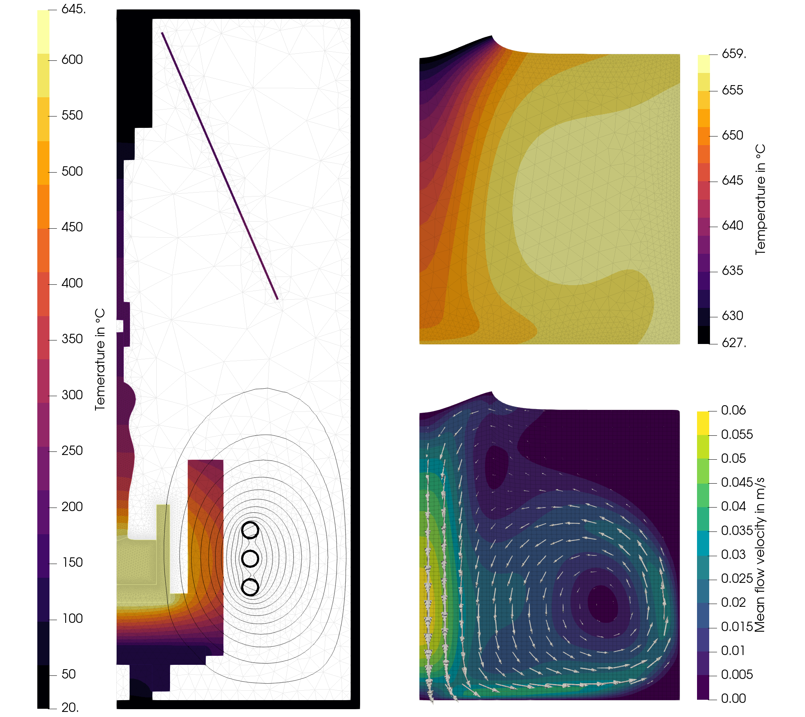

# csi-induction_2D
2D simulation of CsI Czochralski growth with induction heating using an iterative coupling between a global Elmer model and a melt flow OpenFOAM model.

## Overview

An overview of the simulation setup can be found [here](figures/setup.pdf). The following result was obtained for a crystal length of 87mm:

## Configuration, setup, and execution

- The configuration of the simulations is stored in the yaml-files:
  - Main configurations such as the simulation name or the setup of a possible quasi-transient simulation are set in [config.yml](config.yml).
  - Geometry parameters are defined in [config_geo.yml](config_geo.yml). Note, that some parameters of the meshing are directly set in [setup_elmer.py](setup_elmer.py) and [setup_openfoam.py](setup_openfoam.py).
  - The global Elmer simulation is configured in [config_sim.yml](config_sim.yml).
  - The material properties used in the global Elmer simulation are configured in [config_mat.yml](config_mat.yml).
  - The coupling is configured in [config_coupling.yml](config_coupling.yml).
- The mesh of the global model is set up in [setup_elmer.py](setup_elmer.py), which contains also the setup of the global simulation.
- The mesh of the flow model is set up in [setup_openfoam.py](setup_openfoam.py).
- The flow model is configured in the corresponding templates in [openfoam_template_steady](openfoam_template_steady) or [openfoam_template_transient](openfoam_template_transient). The most important settings can be found in constant/transportProperties (material parameters), system/controlDict (simulation time, output), system/changeDictionaryDict (coupling with heat fluxes or fixed temperatures) and 0.orig/U (crystal rotation).
- The simulation is executed using the run scripts:
  - Simulations using the global Elmer model only are executed with the [run_elmer_simulation.py](run_elmer_simulation.py) script.
  - Simulations using the coupled Elmer-OpenFOAM model only are executed with the [run_coupled_simulation.py](run_coupled_simulation.py) script.

## Referencing
If you use this code in your research, please cite our open-access article:

> A. Enders-Seidlitz, J. Pal, and K. Dadzis, Development and validation of a thermal simulation for the Czochralski crystal growth process using model experiments *Journal of Crystal Growth*,  593 (2022) 126750. [https://doi.org/10.1016/j.jcrysgro.2022.126750](https://doi.org/10.1016/j.jcrysgro.2022.126750).

**Note: this reference will be updated soon**
