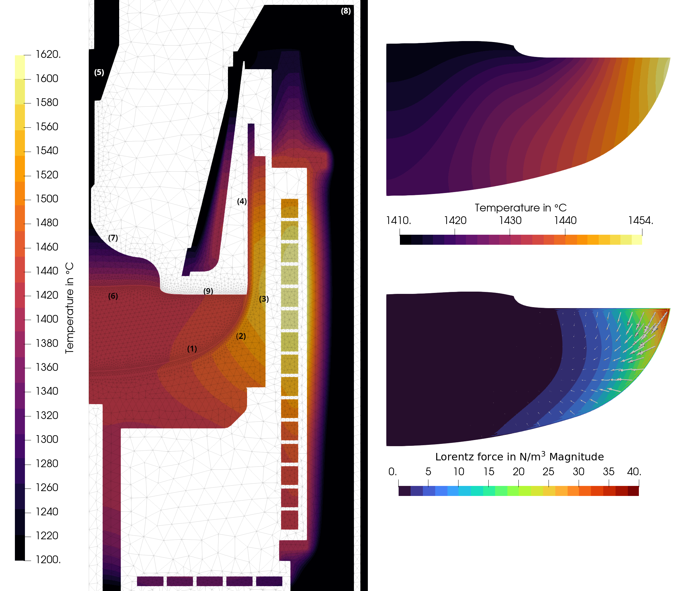
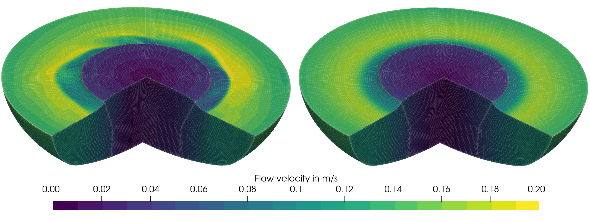
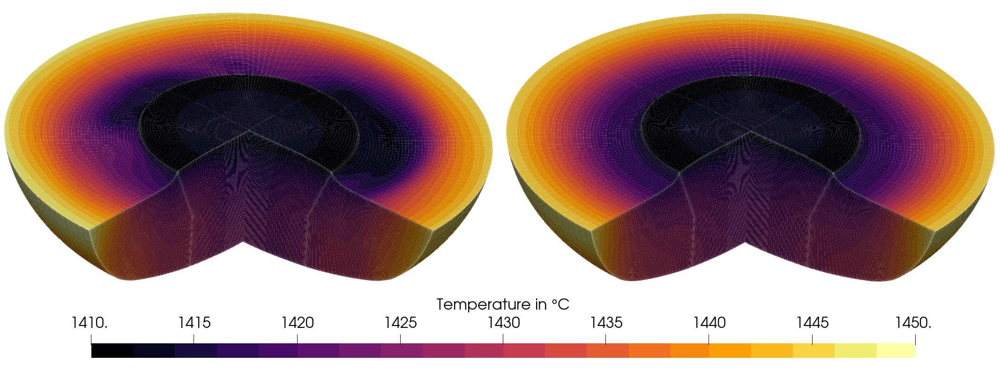

# sim-kristmag-si
2D-2D or 2D-3D simulation of silicon Czochralski growth using a TMF based on the KristMAG technology. Azimuthal averaging with [azimuthalAverage](azimuthalAverage) is based on the code provided in [nemoFoam-utils](https://github.com/nemocrys/nemoFoam-utils).

## Overview

An overview of the simulation setup can be found [here](figures/setup.png). The following result was obtained with an AC current:



The corresponding flow veloctiy and temperature fields (left: snapshot, right: time-average) are:




## Configuration, setup, and execution

- The configuration of the simulations is stored in the yaml-files:
  - Main configurations such as the simulation name are set in [config.yml](config.yml).
  - Geometry parameters are defined in [config_geo.yml](config_geo.yml). Note, that some parameters of the meshing are directly set in [setup_elmer.py](setup_elmer.py) and [setup_openfoam.py](setup_openfoam.py).
  - The global Elmer simulation is configured in [config_sim.yml](config_sim.yml).
  - The material properties used in the global Elmer simulation are configured in [config_mat.yml](config_mat.yml).
  - The coupling is configured in [config_coupling.yml](config_coupling.yml).
- The mesh of the global model is set up in [setup_elmer.py](setup_elmer.py), which contains also the setup of the global simulation.
- The mesh of the flow model is set up in [setup_openfoam.py](setup_openfoam.py).
- The flow model is configured in the corresponding templates in [openfoam_template_steady](openfoam_template_steady), [openfoam_template_transient](openfoam_template_transient), and [openfoam_template_transient_3D](openfoam_template_transient_3D). The most important settings can be found in constant/transportProperties (material parameters), system/controlDict (simulation time, output), system/changeDictionaryDict (coupling with heat fluxes or fixed temperatures, Marangoni coefficient, crystal and crucible rotation), and system/elmerToFoamDict (material parameters).
- The simulation is executed using the run scripts:
  - Simulations using the global Elmer model only are executed with the [run_elmer_simulation.py](run_elmer_simulation.py) script.
  - Simulations using the coupled Elmer-OpenFOAM model only are executed with the [run_coupled_simulation.py](run_coupled_simulation.py) script.


## Heat fluxes

- Additional Elmer Solvers can be loaded at [config_elmer.yml](config_elmer.yml), in this case the SaveScalars Solver can store the heat fluxes over selected boundaries. 

- A typical SaveScalar format for the heat fluxes estimation over boundaries is : 

```yaml
boundary-scalars:
  Exec Solver: 'after saving'
  Equation: SaveScalars
  Procedure: '"SaveData" "SaveScalars"'
  Filename: '"boundary-scalars.dat"'
  Output Directory: './results'
  Operator 1: 'diffusive flux'
  Variable 1: Temperature
  Coefficient 1: 'Heat Conductivity'
```

- To activate the computation, a flag (i.e ``` "save scalars": True ```) has to be assigned at each boundary at [setup_elmer.py](setup_elmer.py).


- After the simulation execution the heat fluxes can be found in :
    - boundary-scalars.dat and  boundary-scalars.dat.names files within the similation folder (Elmer Output).
    - heat-fluxes.yml file at the result folder (OpenCGS post-processing).

Simulation heat flux results :

| Boundary Name                                 | Value (W) | Description                      | Numbering |
|-----------------------------------------------|-----------|----------------------------------|-----------|
| crucible_if_crucible_melt                     | 1657.8    | crucible -> melt                 | (1)       |
| crucible_if_crucsup_cruc                      | -5785.6   | crucible -> crucible support     | (2)       |
| crucible_support_surf_crucsup                 | -8248.1   | crucible support -> atmosphere   | (3)       |
| crucible_surf_cruc                            | 4108.8    | crucible -> atmosphere           | (4)       |
| crystal_if_crystal_seedholder                 | 2.3       | crystal -> seedholder            | (5)       |
| crystal_if_melt_crystal                       | -1674.2   | melt -> crystal                  | (6)       |
| crystal_surf_crys                             | 1704.5    | crystal -> atmosphere            | (7)       |
| insulation_outside_surf_insout                | 2301.9    | insulation outside -> atmosphere | (8)       |
| melt_surf_melt                                | 1272.4    | melt -> atmosphere               | (9)       |
| vessel_bnd_vessel_outside                     | 27222.3   | vessel outer surface             |           |
| vessel_if_axtop3_vessel                       | -33.4     |                                  | --        |
| vessel_if_graphbotin1_vessel                  | -1522.7   |                                  | --        |
| vessel_if_graphbotout1_vessel                 | -7137.3   |                                  | --        |
| vessel_if_insbot1_vessel                      | -810.6    |                                  | --        |
| vessel_if_insout_vessel                       | -965.2    |                                  | --        |
| vessel_if_vessel_axbotsteel                   | -60.7     |                                  | --        |
| vessel_surf_vesselinside                      | -16137.0  | vessel inner surface             | --        |


The last seven heat‐flux boundaries, sum to a total inside heat flux of **26667 W** , where the negative signs denote heat absorption by the vessel.

From the Elmer output, the **heater power scaling** is 0.922. The initial power values for the resistance heaters declared in [config_sim.yml](config_sim.yml) are 5000 W, 11800 W and 12500 W for  for the side-bottom, side-middle, and side-top heaters, respectively. The combined scaled power from all heaters is **27 kW**. 


## Additional details

For a more detailed description including simulation results see:

> A. Wintzer, *Validation of multiphysical models for Czochralski crystal growth*. PhD thesis, Technische Universität Berlin, Berlin, 2024. [https://doi.org/10.14279/depositonce-20957](https://doi.org/10.14279/depositonce-20957)
