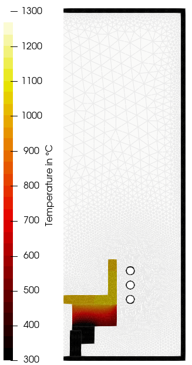

# sn-induction-test_2D
2D simulation of a heating test with induction heating.

## Overview

An overview of the simulation setup can be found [here](figures/setup.png). The following result corresponds to heating test without growing material:

## Configuration, setup, and execution

- The configuration of the simulations is stored in the yaml-files:
    - Main configurations such as the simulation name are set in [config.yml](config.yml).
    - Geometry parameters are defined in [config_geo.yml](config_geo.yml). Note, that some parameters of the meshing are directly set in [setup.py](setup.py).
    - The global Elmer simulation is configured in [config_sim.yml](config_sim.yml).
    - The material properties used in the global Elmer simulation are configured in [config_mat.yml](config_mat.yml).

- The mesh of the global model is set up in [setup.py](setup.py), which contains also the setup of the global simulation.

- The simulation is executed using the run script:
  - Simulations using the global Elmer model only are executed with the [run.py](run.py) script.

## Heat flux estimation

- Additional Elmer Solvers can be loaded at [config_elmer.yml](config_elmer.yml), in this case is included the SaveScalars Solver which stores the heat fluxes over selected boundaries. 

- After the simulation execution the heat fluxes can be found in :
    - boundary-scalars.dat and  boundary-scalars.dat.names files within the similation folder (Elmer Output).
    - heat-fluxes.yml file at the result folder (OpenCGS post-processing).
    

The results are in SI units (W) and the sign points the direction according to the boundary definition in  [setup.py](setup.py).

## Additional details

- For a more detailed description including simulation results see:

> Sepehr Foroushani, Arved Wintzer, Frank-Michael Kiessling, and Kaspars Dadzis. “Heating efficiency and energy saving potential of Czochralski crystal growth furnaces.” *Journal of Crystal Growth*, vol. 662, 2025, Art. 128106. 
> DOI: https://doi.org/10.1016/j.jcrysgro.2025.128106  