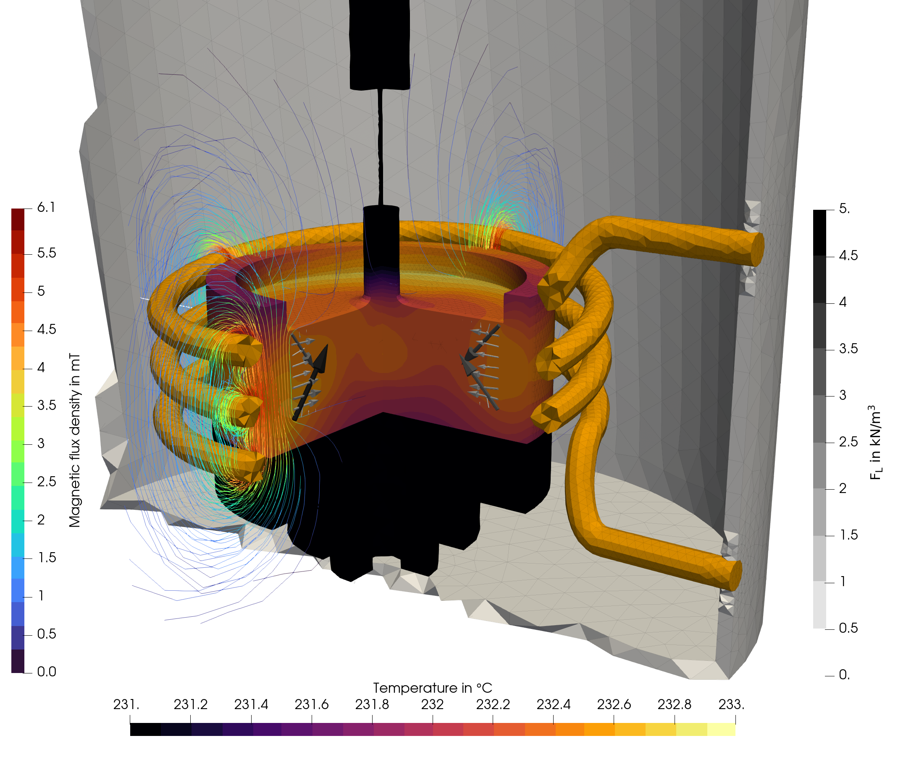
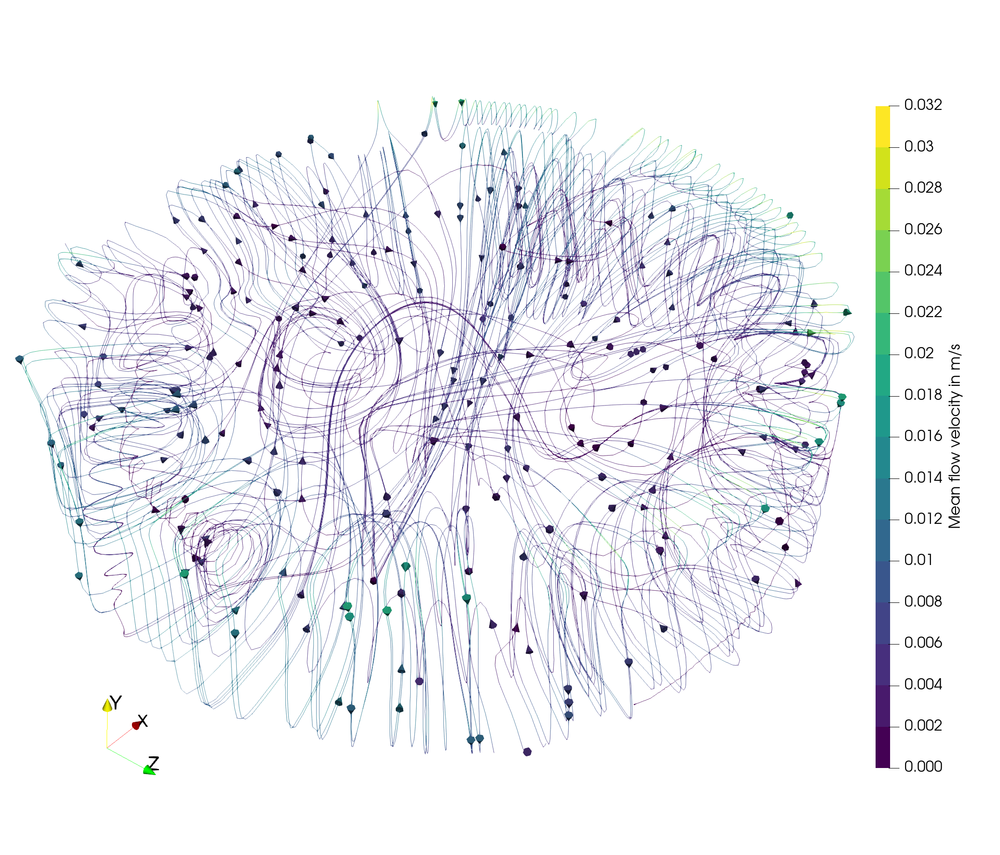

# sn-induction_3D
3D simulation of CsI Czochralski growth with induction heating using a coupling between a global Elmer model and a melt flow OpenFOAM model.

## Overview

An overview of the simulation setup can be found [here](https://camo.githubusercontent.com/c0b28a2c445645c2045e898809f38f6a29eb8656abb430bd06d42fff57a1543a/68747470733a2f2f6172732e656c732d63646e2e636f6d2f636f6e74656e742f696d6167652f312d73322e302d53303032323032343832323030323338582d6772325f6c72672e6a7067). The following result was obtained using a graphite crucible:

## Configuration, setup, and execution

This model is based on the 2D model provided [here](../sn-induction_2D).

- The configuration of the simulation is stored in the yaml-files:
  - Geometry parameters are defined in [config_geo.yml](config_geo.yml) and [setup_run_elmer.py](setup_run_elmer.py). Note, that some parameters of the meshing are directly set in [setup_run_elmer.py](setup_run_elmer.py) and [setup_openfoam.py](setup_openfoam.py).
  - The global Elmer simulation is configured in [config_sim.yml](config_sim.yml).
  - The material properties used in the global Elmer simulation are configured in [config_mat.yml](config_mat.yml).
- The mesh of the global model is set up in [setup_run_elmer.py](setup_run_elmer.py), which contains also the setup of the global simulation.
- The mesh of the flow model is set up in [setup_openfoam.py](setup_openfoam.py).
- The flow model is configured in the corresponding templates in [openfoam_template_steady_3D](openfoam_template_steady_3D) or [openfoam_template_transient_3D](openfoam_template_transient_3D). The most important settings can be found in constant/transportProperties (material parameters), system/controlDict (simulation time, output), system/changeDictionaryDict (coupling with heat fluxes or fixed temperatures) and 0.orig/U (crystal rotation).
- The flow model is set up using [setup_openfoam_3D.py](setup_openfoam_3D.py) with the path to the results of the global model defined in the script.
- The simulation is executed in the following way:
  - The global model is executed with Python using [setup_run_elmer.py](setup_run_elmer.py).
  - The flow model is executed using the `Allrun` script.
- Feedback from the flow model to the global model is possible, but not implemented in an automatized way. Manual coupling by modifying the Elmer sif-file was performed in the reference.

It should be noted that mesh generation for the global 3D model requires a significant amount of memory and was performed on a simulation cluster for the example shown above.

## Referencing
If you use this code in your research, please cite our open-access article:

> A. Enders-Seidlitz, J. Pal, and K. Dadzis, Development and validation of a thermal simulation for the Czochralski crystal growth process using model experiments *Journal of Crystal Growth*,  593 (2022) 126750. [https://doi.org/10.1016/j.jcrysgro.2022.126750](https://doi.org/10.1016/j.jcrysgro.2022.126750).

**Note: this reference will be updated soon**
