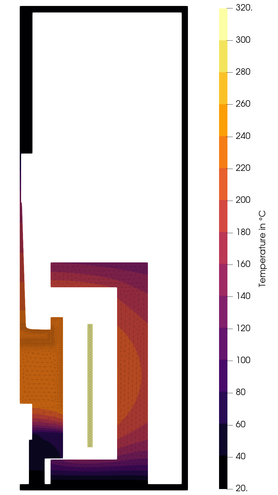

# sn-resistance_2D
2D simulation of CsI Czochralski growth with resistance heating using a global Elmer model.

## Overview

An overview of the simulation setup can be found [here](figures/setup.png). The following result was obtained with full insulation:

## Configuration, setup, and execution

- The configuration of the simulations is stored in the yaml-files:
  - Main configurations such as the simulation name are set in [config.yml](config.yml).
  - Geometry parameters are defined in [config_geo.yml](config_geo.yml). Note, that some parameters of the meshing are directly set in [setup.py](setup.py).
  - The global Elmer simulation is configured in [config_sim.yml](config_sim.yml).
  - The material properties used in the global Elmer simulation are configured in [config_mat.yml](config_mat.yml).
- The mesh of the global model is set up in [setup.py](setup.py), which contains also the setup of the global simulation.
- The simulation is executed using the [run.py](run.py) script.

## Additional details

For a more detailed description including simulation results see:

> A. Wintzer, *Validation of multiphysical models for Czochralski crystal growth*. PhD thesis, Technische Universität Berlin, Berlin, 2024.
